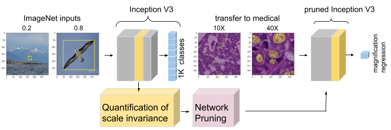
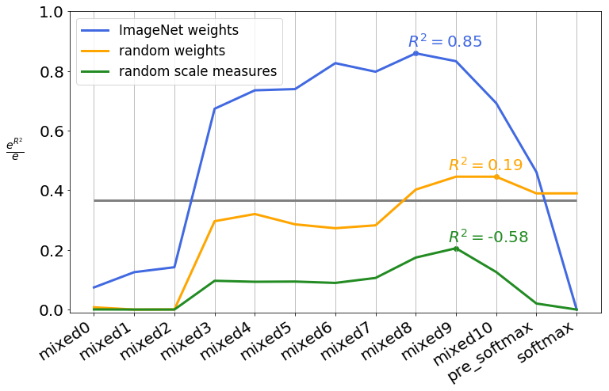
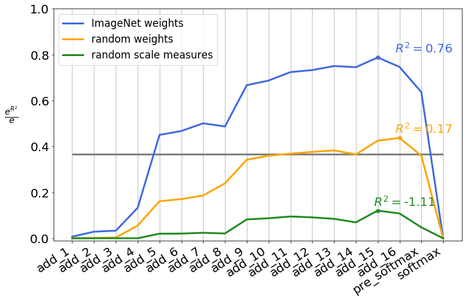
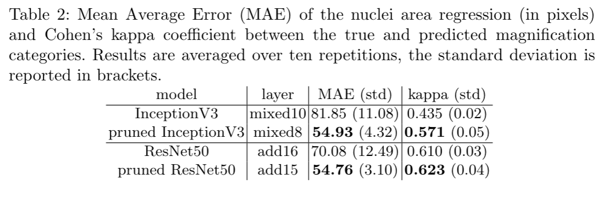

# Interpretable Pruning of CNNs for Scale-Covariant Features in Medical Imaging

This repository contains the code to interpret the classification of the Plus disease in Rethinopathy of Prematurity images by a deep CNN. This paper was presented at iMIMIC at MICCAI 2020. 

## Reference
Main paper to be cited

```
@inproceedings{graziani2020interpretable,
  title={Interpretable Pruning of CNNs for Scale-Covariant Features in Medical Imaging},
  author={Graziani, Mara and Lompech, Thomas and Muller, Henning and Depeursinge, Adrien and Andrearczyck, Vincent},
  journal={Workshop on Interpretability of Machine Intelligence in Medical Image Computing at MICCAI2020},
  year={2020}
}
```
<p align="center">
    
</p>

Image scale carries crucial information in medical imaging, e.g. the size and spatial frequency of local structures, lesions, tumors and cell nuclei.
With feature transfer being a common practice, scale-invariant features implicitly learned from pretraining on ImageNet tend to be preferred over scale-covariant features. The pruning strategy in this paper proposes a way to maintain scale covariance in the transferred features.

We propose to use deep learning interpretability with Regression Concept Vectors to analyze the layer-wise encoding of scale information for popular architectures such as InceptionV3 and ResNet50. The evaluation of the regression vectors with R2 is used to quantify information about scale at each layer.
We then prune off the layer where invariance to scale is learned and show that the pruned networks improve the transfer to the task in medical imaging of predicting the nuclei area and image magnification of breast histopathology images. 

## Dataset 
We use the albatross, kite and car classes from the ImageNet dataset. 
For the histopathology application, we use

## Preview of the results
We show in the following the performance of the RCVs for scale at different layers of the network, averaged over 10 repetitions and over the 3 classes. Interestingly, the covariance of scale peaks at central layers and decreases close to softmax.

<p align="left">
    
</p>

<p align="left">
    
</p>

## Network pruning and transfer to histopathology
We pruned off the deep layers where scale invariance is learned (mixed 9 and 10 for Inception, for example). There are clear gains given by the pruning on the medical imaging task. 

<p align="center">
    
</p>
